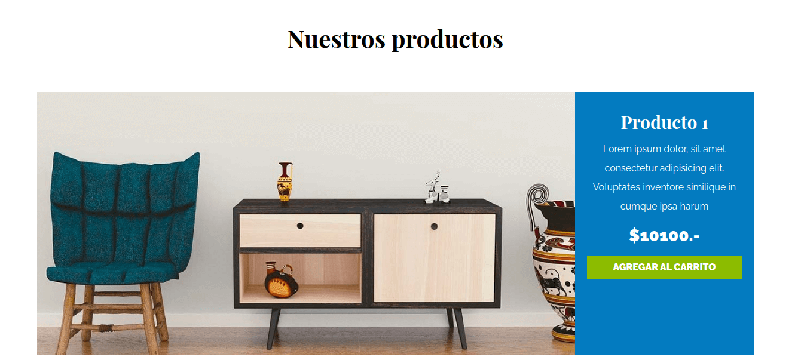

# [Forniture E-commerce](https://forniture-ecommerce.netlify.app "Forniture E-commerce")





## Installation

### clone repo **(gh CLI)**
```
gh repo clone norbix14/css-forniture-ecommerce forniture
```

### run app
```
cd forniture
```

* double click on **index.html**
* use **Live Server**
